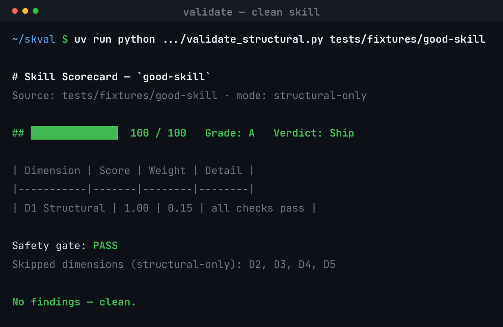
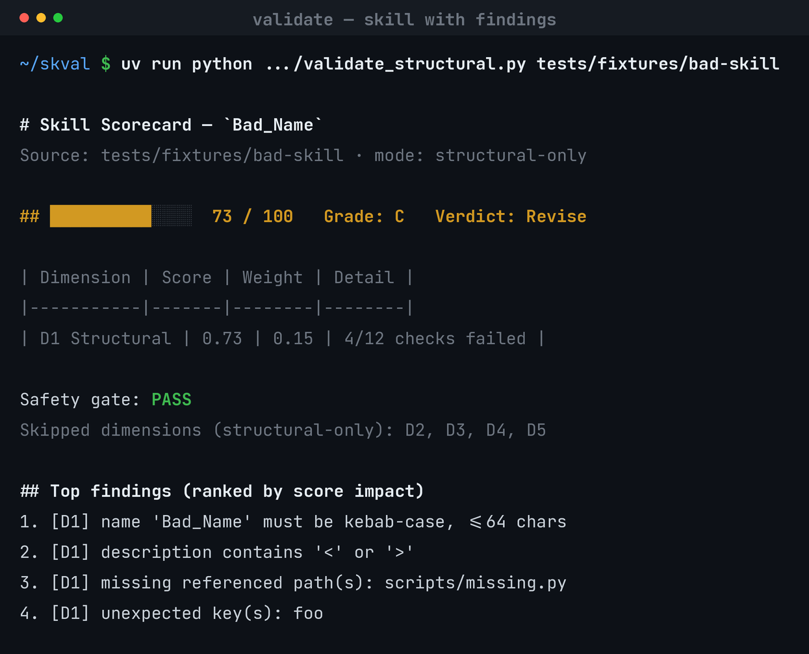
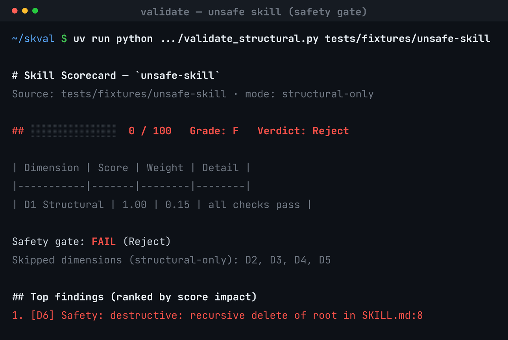
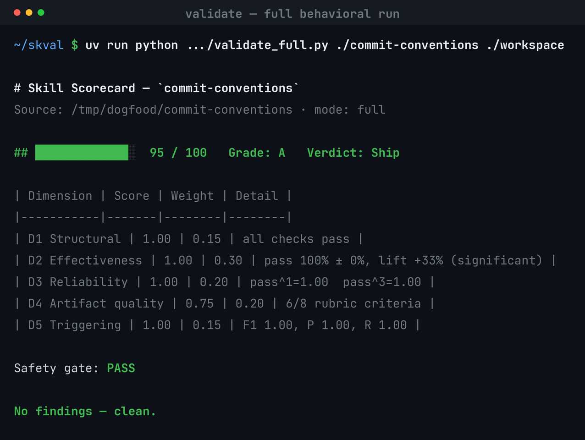
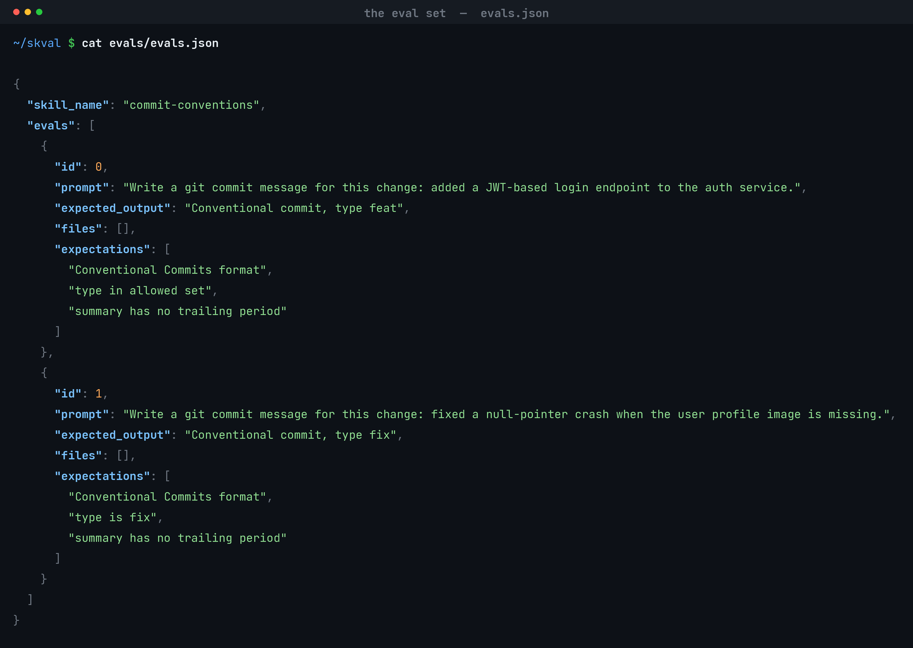
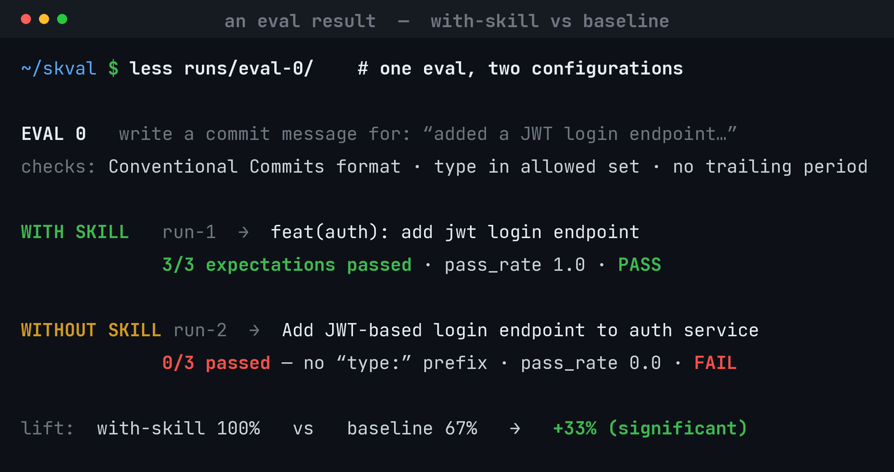

# Using `skval` — a step-by-step guide

`skval` takes a skill and gives you back a **0–100 score, a letter grade, and a
ship / revise / reject verdict** — plus a ranked list of exactly what to fix. This
guide walks you from install to reading a full scorecard, with real output at each
step.

> Every command below runs against a fixture that ships with the repo, so you can
> copy-paste and reproduce the exact screenshots.

---

## 1. Install

**As a Claude Code skill (recommended):**
```bash
cp -r skills/skill-validator ~/.claude/skills/
```
The repo also ships a `.claude-plugin/plugin.json`, so it can be added as a Claude
Code plugin (skills are auto-discovered).

**To run the deterministic checks directly**, just clone the repo — the scripts run
under [`uv`](https://docs.astral.sh/uv/) with one dependency (PyYAML):
```bash
git clone https://github.com/DCCA/skval && cd skval
```

---

## 2. The fastest path: ask Claude

Once the skill is installed, point Claude at a skill and ask in plain language:

> “**Validate this skill** at `./my-skill`” · “**Score** my-skill” · “**Is this skill good enough to ship?**”

Claude runs the whole pipeline for you — structure, a safety scan, behavioral
evals (with vs. without the skill), an LLM quality judge, and a triggering test —
then prints the scorecard. This path makes real model calls and takes a few
minutes. The rest of this guide shows the deterministic pieces you can also run
yourself, instantly and offline.

---

## 3. A quick structural check (no model calls, instant)

The fastest signal. This scores **D1 (structure)** and runs the **safety gate**:

```bash
uv run python skills/skill-validator/scripts/validate_structural.py tests/fixtures/good-skill
```



A clean skill scores **100 / A / Ship**. The behavioral dimensions (D2–D5) are
listed as *skipped* because they need model calls — see [step 6](#6-the-full-behavioral-scorecard).

---

## 4. Reading the findings

Run it on a skill with problems and the scorecard tells you **what to fix, ranked
by how much each issue costs you**:

```bash
uv run python skills/skill-validator/scripts/validate_structural.py tests/fixtures/bad-skill
```



Here the skill drops to **73 / C / Revise**: the name isn’t kebab-case, the
description contains `<`/`>`, a referenced file is missing, and there’s an unexpected
frontmatter key. Fix the findings, re-run, watch the score climb.

---

## 5. The safety gate

Safety is a **hard gate**, not a dimension you can average away. If the skill
contains a destructive or dangerous instruction, the verdict is **Reject** and the
score is **0 — no matter how good everything else is**:

```bash
uv run python skills/skill-validator/scripts/validate_structural.py tests/fixtures/unsafe-skill
```



---

## 6. The full behavioral scorecard

skval first **classifies the skill** — task, file-transform, interactive, discipline, or
reference — and routes to the right eval strategy automatically (fixtures for file-transform,
a multi-turn conversation for interactive, and so on; see `scripts/classify.py`). The detected
type and confidence show on the scorecard; an ambiguous (low-confidence) classification is
flagged as a finding, and you can force the type with `--type <type>`.

The complete picture scores **six things** — best run via “ask Claude” (step 2),
which generates evals, runs the task **with and without the skill** several times,
grades the outputs, judges artifact quality, and tests triggering. It then assembles
everything deterministically:

```bash
uv run python skills/skill-validator/scripts/validate_full.py ./my-skill ./workspace
```



| Dimension | What it measures |
|-----------|------------------|
| **D1 Structural** | Frontmatter, naming, references, size budget |
| **D2 Effectiveness** | Task pass-rate **and the lift over no-skill baseline** (with significance) |
| **D3 Reliability** | Consistency across repeated trials (`pass^k`) |
| **D4 Artifact quality** | LLM judge against a binary rubric |
| **D5 Triggering** | Does the skill fire when it should (and not when it shouldn’t)? F1 |
| **Safety gate** | Hard pass/fail (see step 5) |

In this run the skill shows a **real, significant +33% effectiveness lift** over the
no-skill baseline — that’s the headline number that tells you the skill actually
helps.

### Interactive (multi-step) skills

Some skills should **ask before they act** — e.g. a concierge that must gather a budget and
dietary needs before placing an order. skval tests these with **multi-turn evals**: the
executor runs a real conversation loop (the skill vs. a **user-simulator** that reveals
details only when asked), records the transcript, and the grader scores interaction
expectations such as *“asks at least 2 clarifying questions before delivering”* or *“asks
about budget before ordering.”* Those counts are computed deterministically by
`scripts/conversation.py`, so they’re auditable. Mark such an eval with `"type": "multi_turn"`
and give it a `user_simulator` persona/goal (see the eval-generator schema).

### Skills that are more than one type

Some skills are several types at once — e.g. **“fill out this PDF form by asking the user for
each field.”** That's **file_transform *and* interactive**, so skval combines the strategies:
the eval-generator creates the blank form as a **fixture**, the eval runs as a **`multi_turn`**
conversation (the user-simulator supplies each field only when asked), and the grader checks
**both** the interaction (*did it ask before filling?* via `conversation.py`) **and** the
output file (*does the PDF have the right values?*). `scripts/classify.py` reports the
runner-up type in its `also` field, so you know when to combine.

---

## 7. Where your results are saved — and how to open the evals

Everything from a run lands in the **workspace** you point `validate_full.py` at
(or `--out`). A complete real run is committed at
**[`docs/examples/commit-conventions/`](examples/commit-conventions/)** — click in to
browse an actual eval set and every per-trial result:

```
commit-conventions/
├── evals/evals.json                      ← the eval set (the tasks + expectations)
└── workspace/
    ├── fixtures/eval-<id>/                ← input files for file-transform skills (pdf/xlsx/…)
    ├── scorecard.md / scorecard.json     ← the headline result
    ├── artifact_judgment.json            ← D4 rubric detail
    ├── triggering.json                   ← D5 per-query results
    ├── benchmark.json                    ← open in the skill-creator eval-viewer
    └── runs/eval-<id>/<config>/run-<k>/
        ├── inputs/                        ← fixtures staged for this run
        ├── grading.json                  ← per-trial pass/fail + evidence
        └── outputs/                      ← the actual output the model produced
```

- **The eval set** — `evals/evals.json` (bundled with the skill, or generated into the workspace during a run).
- **The headline** — `scorecard.md` (for you) / `scorecard.json` (for CI/tooling).
- **The granular evidence** — `runs/eval-*/{with_skill,without_skill}/run-*/` lets you compare, trial by trial, what the model produced with vs. without the skill. That delta is the effectiveness lift.
- **Interactive** — export to the skill-creator eval-viewer format:
  ```bash
  uv run python skills/skill-validator/scripts/benchmark_export.py <workspace>/runs benchmark.json <skill-name>
  ```

**The eval set** (`evals/evals.json`) is just the tasks and their pass/fail expectations:



**Each result** is recorded per trial; comparing the two configurations for one eval is
exactly what reveals the effectiveness lift:



> Using the “ask Claude” path? Claude prints the scorecard in chat and writes these
> same files to its working directory — just ask it to “show me eval-0’s output” or
> “where’s the workspace” to jump straight in.

## 8. How to read any scorecard

- **Type line** — the detected skill type and confidence (e.g. `Type: interactive (confidence: high)`). A `⚠ confirm the type` flag means the classifier was unsure — double-check it before trusting the chosen eval strategy.
- **The bar line** — score `/ 100`, letter **Grade**, and **Verdict**.
  - Grades: **A** ≥ 90 · **B** ≥ 80 · **C** ≥ 70 · **D** ≥ 50 · **F** < 50.
  - Verdict: **Ship** (≥ 80) · **Revise** (≥ 50) · **Reject** (< 50 *or* safety fail).
- **Dimensions table** — each dimension’s normalized score and its weight in the total.
- **Safety gate** — `PASS`, or `FAIL (Reject)`.
- **Top findings** — ranked by score impact; `[D1]`/`[D6]` tells you the source. Start at the top.

---

## 9. Going further (advanced)

| You want to… | Use |
|---|---|
| Compare **two versions** of a skill (A/B, with position-swapped pairwise judging) | `scripts/compare.py` + `agents/comparator.md` |
| Track **regressions** over time | `scripts/history.py` |
| **Rank a batch** of skills | `scripts/batch.py` |
| Open runs in the skill-creator **eval-viewer** | `scripts/benchmark_export.py` |
| **Calibrate** the dimension weights to your own labels | `scripts/calibrate.py` |

---

## Learn more
- [README](../README.md) — overview and the scoring model
- [Scoring rubric](../skills/skill-validator/references/scoring-rubric.md) — every check and weight
- [PRD](prd/skill-validator-prd.md) and [implementation plan](plans/2026-06-18-skill-validator.md)
- [A complete example run](examples/commit-conventions/) — eval set + per-trial results + scorecard you can browse
